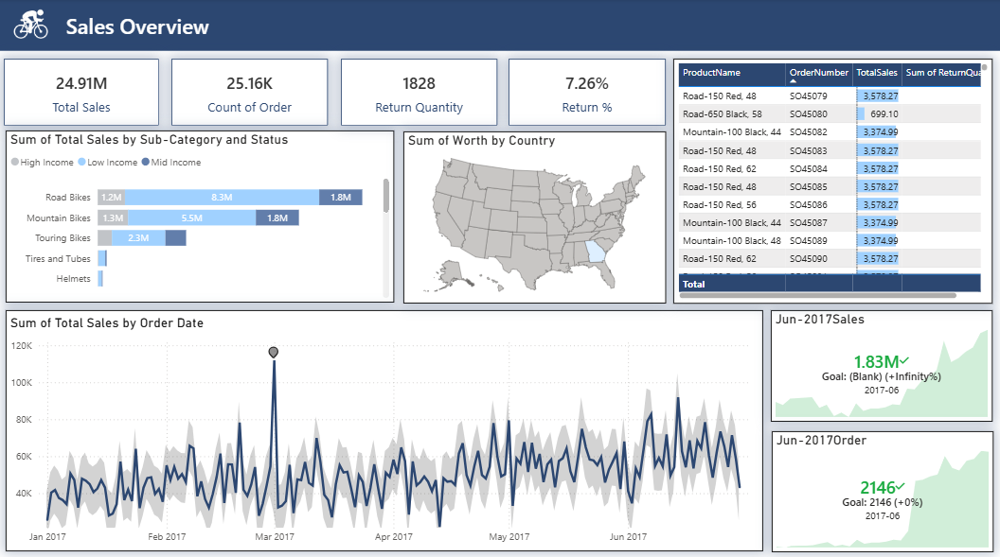

# Sales Overview Dashboard

## Project Overview

This project focuses on analyzing sales performance and return trends using an interactive Power BI dashboard. The dashboard provides insights into total sales, order volume, return quantity, product performance, customer income categories, geographical sales distribution, and sales trends over time.

The main objective of this project is to transform raw sales data into meaningful business insights that support data-driven decision-making.

---

## Project Objective

The purpose of this project is to:

- Analyze overall sales performance
- Track order count and return percentage
- Identify top-performing products and categories
- Understand customer purchasing patterns
- Monitor sales trends over time
- Visualize geographical sales distribution
- Generate business insights through interactive reporting

---

## Tools & Technologies Used

- **Microsoft Excel** – Data Cleaning & Data Preparation  
- **Power Query** – Data Transformation, Cleaning & Exploratory Data Analysis (EDA)  
- **Power BI** – Interactive Dashboard Development & Data Visualization

---

## Data Cleaning & EDA Process

Data preprocessing and exploratory analysis were performed using **Excel** and **Power Query**.

### Data Cleaning Steps

- Removed duplicate records
- Handled missing/null values
- Corrected inconsistent formatting
- Standardized column names
- Converted data types for better analysis
- Cleaned sales and return-related fields

### Exploratory Data Analysis (EDA)

- Checked sales trends over time
- Analyzed product category performance
- Evaluated return quantity and return percentage
- Compared sales across customer income categories
- Analyzed country-wise sales distribution
- Identified top-performing products

---

## Dashboard Features

The interactive Power BI dashboard includes the following KPIs and visualizations:

### Key Performance Indicators (KPIs)

- **Total Sales:** ₹24.91M  
- **Total Orders:** 25.16K  
- **Return Quantity:** 1,828  
- **Return Percentage:** 7.26%

### Visualizations Included

- Sales by Product Sub-Category and Income Status
- Country-wise Sales Distribution (Map Visualization)
- Product-Level Sales & Return Analysis
- Sales Trend Over Time
- Monthly Sales KPI Tracking
- Order Performance Monitoring

---

## Key Insights

- Sales performance reached **₹24.91M** with over **25K orders** processed.
- Return percentage remained around **7.26%**, helping evaluate product quality and customer satisfaction.
- **Road Bikes and Mountain Bikes** generated higher sales compared to other categories.
- Sales fluctuated over time with noticeable spikes during certain periods.
- Geographic analysis enabled comparison of country-wise business performance.
- Product-level tracking helped identify top-selling products and return behavior.

---

## Dashboard Preview



> Replace `dashboard.png` with your dashboard screenshot filename after uploading to GitHub.

---

## Project Workflow

```text
Raw Dataset
    ↓
Excel Cleaning
    ↓
Power Query Transformation & EDA
    ↓
Data Modeling in Power BI
    ↓
Interactive Dashboard Creation
    ↓
Business Insights & Reporting
```

---

## Skills Demonstrated

- Data Cleaning  
- Data Transformation  
- Exploratory Data Analysis (EDA)  
- Data Visualization  
- Dashboard Development  
- KPI Reporting  
- Business Analysis  
- Power BI Reporting  
- Excel Data Processing  
- Power Query

---

## Project Outcomes

This dashboard helps businesses:

- Monitor sales performance
- Track product returns
- Identify profitable product categories
- Analyze customer purchasing behavior
- Support business decisions through visual reporting

---

## Repository Structure

```text
📁 Sales-Overview-Dashboard
│── 📄 README.md
│── 📊 Sales_Dashboard.pbix
│── 📂 Dataset
│── 🖼️ dashboard.png
```

---

## Connect With Me

**LinkedIn:** linkedin.com/in/gunwant-katale-867919208
